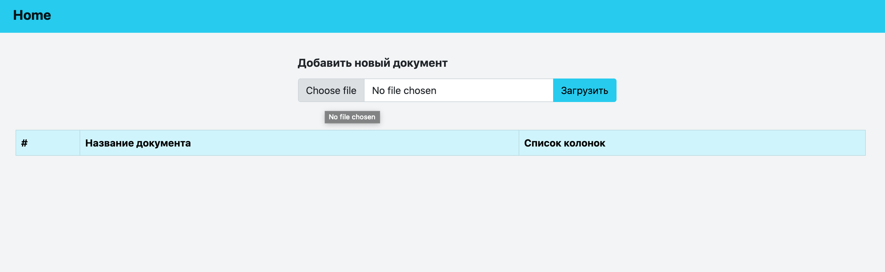
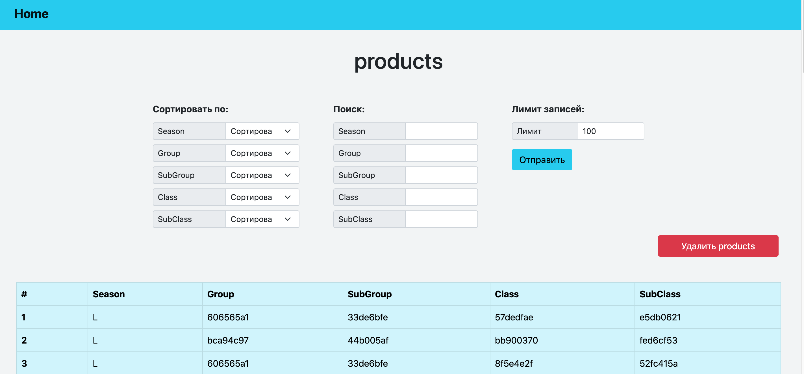
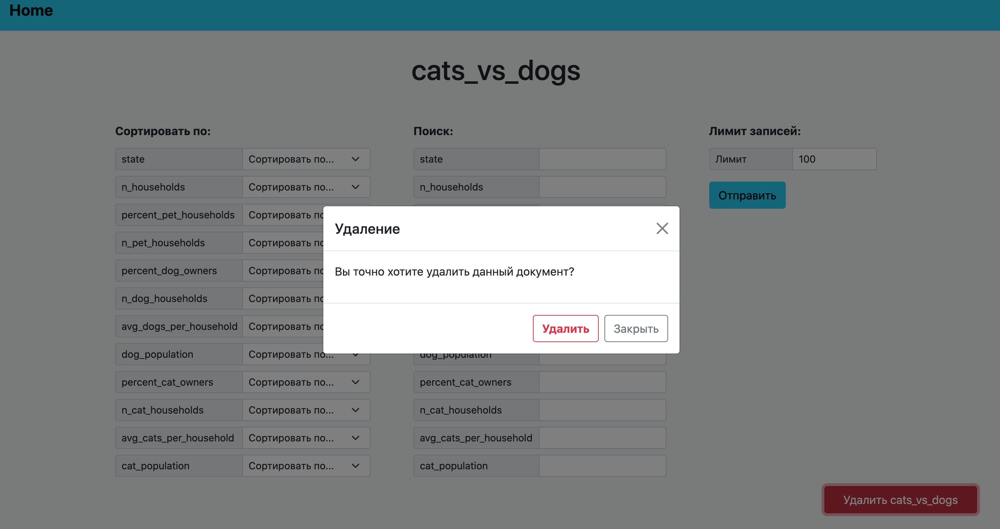
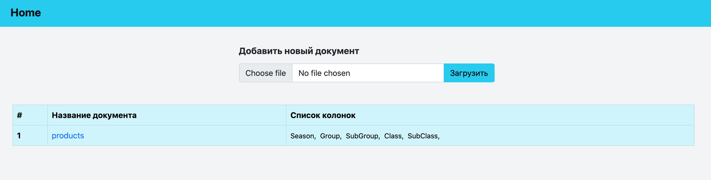

# ProKomp-test

Задание:

Необходимо разработать HTTP сервис для работы с импортируемыми данными.
Должна быть реализована загрузка данных в формате csv (напр. датасеты с Kaggle). Структура файлов неизвестна и может изменяться от файла к файлу.

Помимо загрузки файлов необходимо реализовать следующий функционал:
- Получение списка файлов с информацией о колонках
- Возможность получения данных из конкретного файла с опциональными фильтрацией и сортировкой по одному или нескольким столбцам

Использовать рекомендуется любой из языков: python, C++, C#,  можно применять любые библиотеки, фреймворки, базы данных и все, что покажется необходимым.

Дополнительно можно реализовать:
- Покрытие исходного кода тестами
- Авторизацию пользователя
- Дополнительные эндпойнты, напр. удаление ранее загруженного файла
- Dockerfile для запуска сервиса в Docker
- прочее

Исходный код необходимо выложить на github, в Readme к проекту написать небольшую документацию по API и развертыванию приложения.

## Аннотация к тестовому заданию

Данное тестовое задание написано на python 3.10 с использованием Fastapi и шаблонизатора Jinja2. База данных - MongoDB. 

## Сборка docker-образа и запуск docker compose

Скачайте код:
```
https://github.com/Woodwine/ProKomp-test.git
```
Перейдите в каталог проекта.
Проверьте, что у вас установлен docker и docker compose:
```
docker --version
docker-compose --version
```
Убедитесь, что Docker daemon запущен:
```
sudo systemctl status docker
```
Если docker не запущен - запустите его:
```
sudo systemctl start docker
```
Запустите сборку контейнеров:
```
docker compose build
```
Старт приложения:
```
docker compose up
```

Приложение будет доступно по адресу http://localhost:8000/documents/, можно протестировать отправку запросовб загрузку файлов и фильтрацию. Автоматически сгенерированная документация доступна по адресу http://localhost:8000/docs, в ней так же можно протестировать отправку запросов.

Переменные окружения в docker-compose.yaml прописаны напрямую, но вы можете вынести их в отдельный файл(например .env) и прописать в docker-compose.yaml ссылку на этот файл вместо переменной environment. Для примера:
```
env_file:
  - .env
```

## Примеры запросов

После запуска контейнеров наша главная страница не содержит загруженых документов, так как база данных в контейнере еще пуста:



Загрузим один csv-файл, переходим на страницу с сохраненным файлом. По умолчанию отображаются первые 100 строк, 
количество можно изменить в поле limit:



Также при необходимости документ можно удалить:



Вернемся на домашнюю страницу (Home), сохраненный документ и список колонок появился в таблице:


